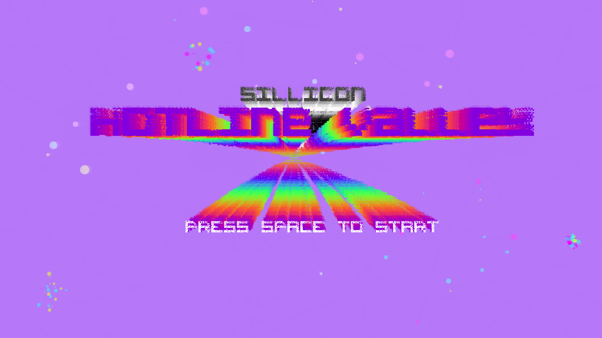
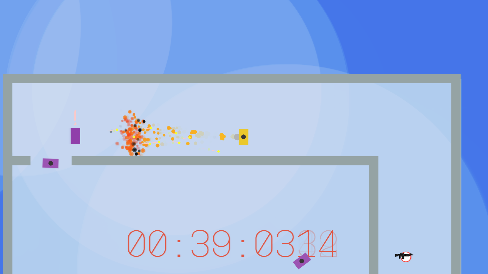
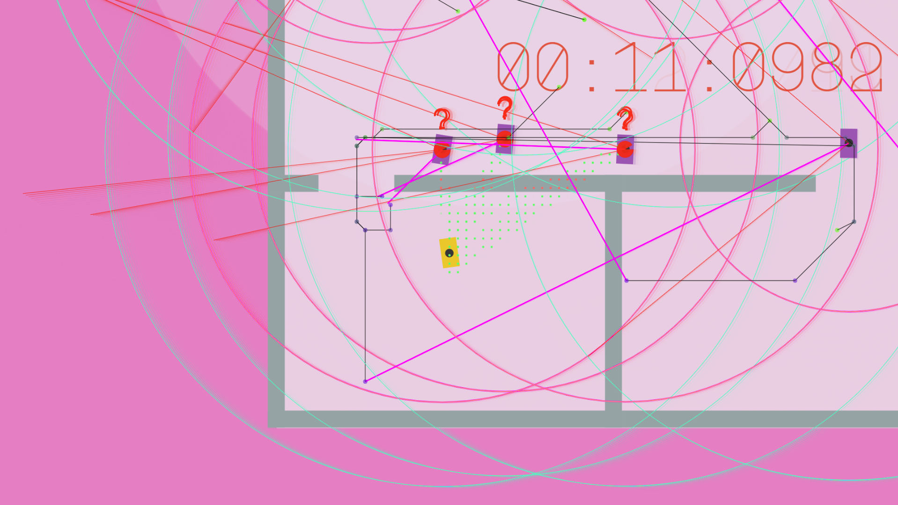
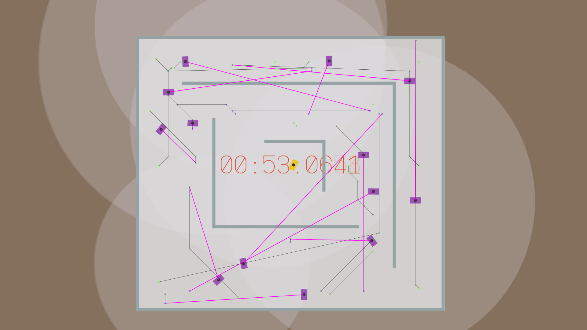
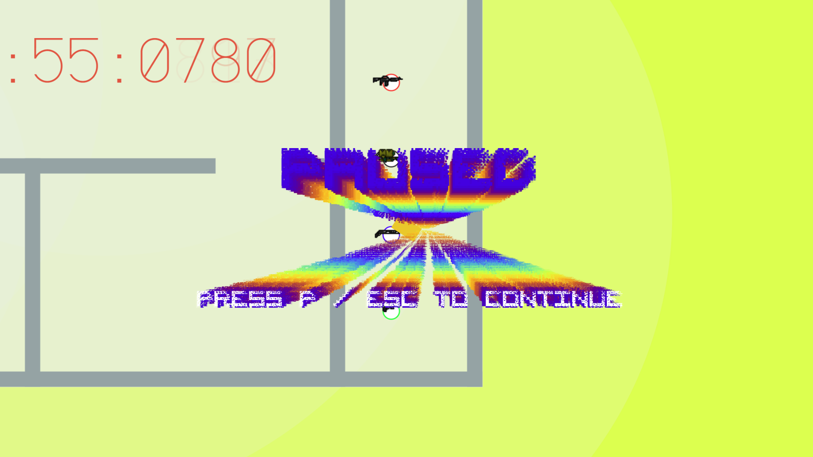
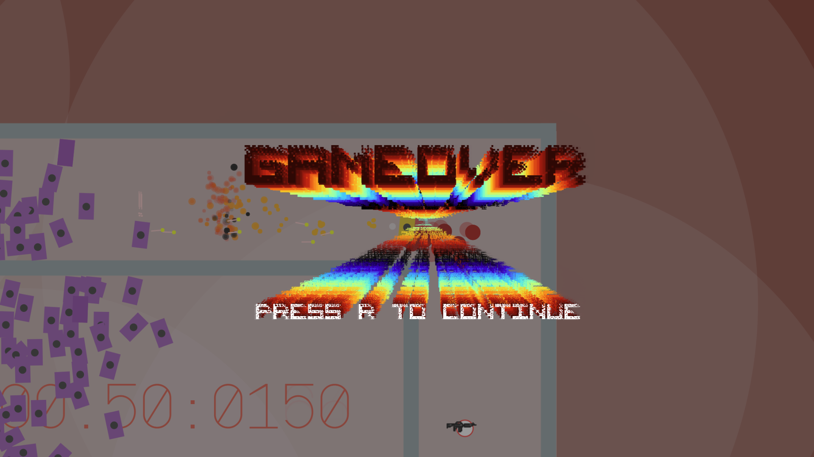
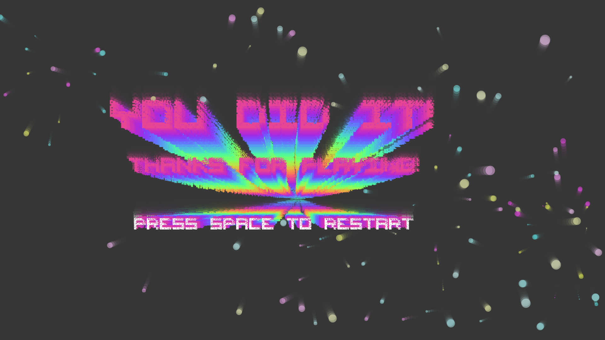

# Multi Agent Game

The purpose of this project was to develop a platform to allow for the comparison of different paradigms of NPC agent ai. The game runs in the browser and the client is served files via node js server listening for requests for the home page.

The Game itself mirrors the style and paceing of hotline miami with its top down twitch style shooting. The Environment is far more minimial than the inspiration game both as a processing consideration and to better see how the ai works without too much distraction.

The games developmental progress is documented in this trello, which shows all major changes and additions to the game.

 - https://trello.com/b/r6EXjrxF/dissertation

The game engine makes use of several libraries:

 - http://github.com/bgrins/javascript-astar
 - https://github.com/Calamari/BehaviourTree.js
 - https://github.com/jriecken/sat-js
 - **https://github.com/timohausmann/quadtree-js/** (Not Integrated Yet)

### Screen Shots

- - -

- - -

- - -

- - -

- - -

- - -

- - -
